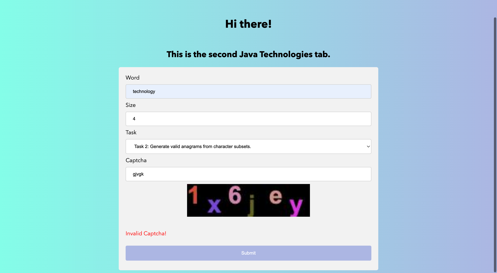

# Lab 2

## Table of Contents

1. [Compulsory](#compulsory)
2. [Homework](#homework)
3. [Bonus](#bonus)
4. [Screenshots](#screenshots)
5. [Notable Contributions](#notable-contributions)

## Compulsory

**Task:** _Create a Web application (starting from the previous lab) containing the following components:_

- `input.jsp`: _a page containing a form for introducing some letters and a size_

- `result.jsp`: _a page describing the response that will be delivered to the client, for example an HTML table containing the words of the given size._

**Solution:** The two JSP files have separate concerns and different sources for the displayed content:

- `input.jsp`: the content is hardcoded and allows the user to input data

- `result.jsp`: the content is generated dynamically by filling in the gaps with the _attributes_ attached to the request. Those attributes are set by the `HandleWordServlet` and are entirely dependent on the user's input.

 

## Homework

**Task:** _Organize the application so it contains:_

- _an object-oriented domain model_

- _a server-side component responsible with the business-logic of the application: writing the words to a file, reading data from a file, etc._

- _a server-side component responsible with controlling the web-flow_

- _a web filter that will log all requests received by input.jsp_

- _a web filter that will decorate the response by adding a specific prelude (at the beginning) and a specific coda (at the end) to the generated HTML page_

**Solution:**

- **Model:** The `DictionaryPair` class respresents the main model of the application and contains a _word_ and its corresponding _Counter_ (_i.e. a mapping between its composing characters and their frequency_)

- **Business Logic:** The three areas of functionality needed are separated into three different classes:

  - `InputValidation`: handling all things needed with regards to input validation (_i.e. String to Integer conversion, size parameter validity_)

  - `DictionaryUtils`: handling the creation of the dictionary list, by way of reading and converting the words from the file to a list of **DictionaryPair** objects

  - `WordUtils`: handling the generation of subwords and the filtering of valid words by comparing the **Counters** of the potential words to those of the words in the dictionary and keeping the matches

- **Web Flow**: There are now two servlets:

  - `LandingServlet`: Created for handling the landing part of the flow

  - `HandleWordServlet`: Created for handling the word processing (_using the business logic components_) and further passing the result

- **Web Filters**: The tasks were solved by using both a wrapper and a filter (`ResponseWrapper` and `ResponseFilter`)

 

## Bonus

**Task:**

- _Create a web listener that reads a default category specified as a context init parameter at the application start-up. This default value should be stored in an attribute having application scope and it will be used whenever the request does not contain a category._

- _Use a "hand-made" cookie to store the category selected by the client. When the user returns to the site (after the current session was invalidated) and presents this cookie, the category will be set automatically._

- _Add an original CAPTCHA facility to the input form._

**Solution:**

- **Web Listener:** Created the `CategoryWebListener` listener that does exactly what it is supposed to do.

- **Cookie:** The cookie saves the previously selected task type, which also represents the above-mentioned category.

- **Captcha**: The Captcha has randomly generated letters of different fonts, positions and colors. If the user wrongly guesses the Captcha content, an error message will appear. As seen in the last screenshot.

 

## Screenshots

 

## Notable Contributions

- Aesthetically-Pleasing Front-End using CSS
- Provided Screenshots

- Very Clear Readme.md
- Adherence to Java Naming Conventions
- Documented using Javadocs
- Javadoc Site Can Be Found at `target/site/index.html`
